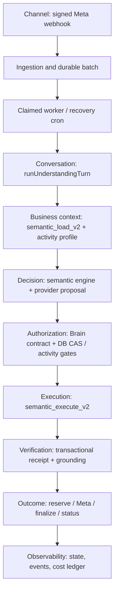

# DABBIR: authority map and incremental refactor

Status: PARTIALLY VERIFIED. This is an implementation ledger, not launch approval.

## Observed baseline

- Requested historical baseline: `eb826bca7f08b7b5b58bba06639f31b21a23c0c4`.
- Current main and authenticated Production release endpoint, 2026-09-10:
  `0ae7e93b54478c35fa3da55c8c8202e139b62b8b`, deployment
  `dpl_3De4C1Sy5etgSc6soyqjKYmh6hf5` (PR #695 greeting fix retained).
- Local baseline: 2716 tests, all passed, zero skipped.
- No replay of PRs #687–#693; #694 remains evidence-only.
- `baseline-call-map.json`: 288 API JS modules, 517 literal import edges,
  1445 top-level functions, zero import strongly-connected components.
  44 local unreachable candidates, including 24 in the old AI core and 16
  in the service-menu wrapper. Candidate status alone does not permit deletion.
- The AST audit includes literal dynamic imports and RPC call sites. It does
  not prove absence of externally deployed callers, dynamic SQL or reflective
  access. Read-only live `pg_proc` inspection confirmed the RPC boundaries below.

## Real request path

The diagram is the operational sequence, not an import layering claim.
The provider only proposes an interpretation. PostgreSQL remains authoritative
for state versions, tenant and branch scope, activity requirements and mutations.
The deployment topology remains the existing modular monolith plus PostgreSQL
and its existing scheduled/Edge adapters. No framework or service is added.

## Contracts and canonical owners

| Boundary | Current owner | Input → output | Allowed dependencies | Failure behavior | Verification |
|---|---|---|---|---|---|
| Meta authentication / ingestion | `dabbir-whatsapp-webhook.js`; Coexistence reuses `verifyMetaSignature` | Raw signed bytes → normalized text/location/voice/status event | Crypto, parsers, persistence adapters, safe telemetry | Invalid signature/raw body rejected before persistence | Webhook signature, raw-body, branch-routing suites |
| Durable inbound | SQL `dabbir_whatsapp_persist_inbound`; location/voice/Flow adapters | Provider ID + receiving phone ID → tenant-scoped conversation/message/batch IDs | Exact connection lookup, customer resolver, inbox tables | Unique provider event, incomplete or unverified persistence rejected | Real-DB ingestion and tenant isolation |
| Dispatch / recovery | Current service-menu wrappers delegate to `processClaimedWhatsAppAiBatch` | Opaque dispatch token / bounded recovery limit → claim state and outcome | Claim/finish RPCs and AI worker core | No work without DB claim; CAS conflicts cancelled, ambiguous sends handed off | Dispatch contract suite; full deployed journey |
| Conversation | `runUnderstandingTurn` in `_dabbir-understanding-orchestrator.js` | Claim + scoped context + explicit effect ports → decision/state/outcome | Semantic engine, Brain contract, cognitive/context helpers; injected RPC/delivery | Missing scope/requirements block mutation; proposal is not permission | Understanding, cognitive, greeting, real-DB concurrency suites |
| Business/activity/service facts | SQL `dabbir_activity_profile_v1` and private `activity_contract_v1`; JS `_dabbir-activity-intelligence.js` validates projection | Verified tenant/branch/service → versioned requirements/allowed actions | DB activity registry, verified facts/memory, exact service/worker scope | Missing/stale/unconfigured contract blocks operation | Activity authority/configuration/delivery-mode suites |
| Decision | `_dabbir-semantic-engine.js` + `_dabbir-semantic-interpreter.js` | Bounded redacted context + customer turn → typed proposal | Pure semantic helpers; metered provider interface | Invalid/uncertain proposal cannot authorize writes | Frozen understanding cases and contract tests |
| Authorization | `_dabbir-brain-contract.js`; SQL `understanding_assert_batch_v2`, `activity_assert_execution_v1` | Decision + matching scope/version/lock/confirmation → permitted action | Persisted state, account/membership, service contract | Fail closed on version drift, takeover, unsupported action or missing facts | Tenant/WhatsApp isolation, CAS/replay and confirmation tests |
| Booking execution | WhatsApp `dabbir_semantic_execute_v2` → existing create/cancel/reschedule RPCs; owner `_dabbir-owner-booking.js` → `dabbir_owner_activity_booking_v1` | Authorized typed action → transaction result | DB locks, idempotency ledger, appointments, activity assertions | Rollback on invalid scope, conflict or stale confirmation | Real PostgreSQL independent-session mutation/replay proof; owner booking tests |
| Verification / outcome | Transactional execution receipt, `verifiedAvailability`, `assertResponseGrounding`; outbound finalizer + signed statuses | Persisted receipt → scoped result and justified response | DB-returned facts only | Never claim mutation/delivery without corresponding evidence | Grounding, receipt, finalization, ambiguous readback tests |
| Customer persistence | Private `resolve_whatsapp_customer_v1` for text/voice; Coexistence still has an independent writer | Receiving tenant + provider handle → canonical customer ID | Customer/identity tables and uniqueness constraints | Scope mismatch/conflict fails closed | Canonical customer persistence and isolation tests; Coexistence debt retained |
| Provider abstraction | `_ai-core.js`; semantic interpreter calls metered interface | Bounded request + attribution → validated proposal/usage | Existing configured providers; budget/failover/meter | Bounded fallback, no invented zero cost or false success | Provider budget/failover/meter suites |
| Observability | `_observability.js`, AI meter, understanding events/state | Correlation + bounded redacted metadata → trace/usage records | Logs and accounting/event RPCs | Core evidence failures block truth claims; best-effort telemetry explicitly separate | Privacy/redaction, metric size and billing attribution tests |

Booking execution is **not yet one global writer**: owner, WhatsApp and other
operational adapters have distinct SQL entrypoints, some sharing guards/locks.
This is recorded as debt, not falsely renamed into a single authority.
RLS, authorization, tenant isolation and confirmation constraints remain at
their existing boundaries throughout the migration.

## Slice 1: text/template transport

Before: `_whatsapp-live-core.js` independently implemented two HTTP sends,
timeouts and provider outcome classifiers.

After: both public functions keep their existing prerequisite checks, payload
normalization, signatures and error codes, and call
`_whatsapp-message-transport.js::sendMetaMessage`.

Transport input is an already-authorized token/phone, exact wire message and
compatibility error names. Output is `{providerMessageId, providerStatus}`;
it means provider acceptance only. The transport performs one attempt, has a
10-second timeout, owns no DB writes, and never retries. A 5xx, missing receipt,
network TypeError or timeout remains ambiguous. A 4xx remains definitive.
Reservation, exact branch connection, finalization, signed status and
authenticated readback authorities are unchanged.

Catalog, Flows and an unreachable legacy interactive-list sender are still
separate implementations at this slice. No legacy path is deleted in slice 1.

Tests: 28 added behavioral cases exercise real exported text/template adapters,
exact wire payload, acceptance without delivery claim, 400/401/403/429/500/503,
malformed/missing receipts, network errors, precise timeout, capability denial
and OIDC template compatibility. Existing source-location assertion points at
the extracted classifier; its assertion is unchanged. Full local suite:
2744 passed, zero failed/skipped. Deployed verification is pending.

## Before/after measurements

| Measurement | Baseline | Slice 1 | Interpretation |
|---|---:|---:|---|
| Text/template transport implementations | 2 | 1 | One shared timeout/outcome implementation |
| Transport implementation blocks to inspect per text/template transport bug | 2 | 1 | Static inspection count, not measured repair time |
| Source files to change for a common text/template transport defect | 1 | 1 | Both implementations previously lived in one file |
| `_whatsapp-live-core.js` lines | 331 | 256 | Extracted transport owns 55 lines separately |
| API JS import cycles | 0 | To be regenerated | Literal import graph only |
| Isolated transport behavior cases | 0 in dedicated suite | 28 | No DB/model/Meta credentials required |
| Mutation/security files changed | 0 | 0 | No migration, RLS, auth, Brain or reservation edits |
| Owner lookup time / actual files touched per future bug | Not measured | Not measured | No fabricated productivity percentage |

## Next slices and deletion gate

1. Unify remaining active Meta transport implementations with compatibility
   tests for their distinct failure metadata and durable Flow receipts.
2. Migrate dispatch/recovery callers onto one owner with explicit legacy default
   preservation. Keep compatibility wrappers until exact-SHA Production journey
   and regression tests pass.
3. Remove proven unreachable local planner, booking and rendering functions only
   after the caller migration has been Production verified. Replace misleading
   source-only legacy tests with behavioral assertions on the live authority.
4. Inventory every live SQL writer and external Edge caller before consolidating
   owner/WhatsApp/other booking or customer writers. Do not remove SQL functions
   based solely on repository search.

Every deployment must retain required CI/mobile/security gates, exact release
identity before/after the full Arabic/English iPhone/iPad journey, and isolation
checks. A real-phone Meta round trip is a separate acceptance item and is not
claimed by mocked transport or protected Production journey evidence.

## Slice 2: canonical dispatch owner (migration, no deletion)

The public worker and recovery cron now import
`_dabbir-whatsapp-dispatch.js`. Its claim/wait/recovery and failure functions are
copied byte-for-byte from the existing active service-menu wrapper, keeping
its default recovery limit of 12, cap of 25, claim lock, failure mapping and
fallback behavior. The old module is retained unchanged for the deletion gate.
No decision/Brain behavior or SQL is changed.

18 executable contract cases cover non-claims, WAIT re-claim, denied context,
claim storage failure, recovery termination, exact lock propagation and limits.
Four architecture gates prevent a new transport dependency, direct provider
access from the Brain, divergence between worker/cron owners, and introduction
of another direct Meta messages sender outside the explicit migration inventory.

`live-sql-ownership.json` records a read-only catalog scan of 227 live functions
with qualified calls/writes. A shared table is not proof of duplicated business
logic: privacy cleanup, name editing, payment status triggers and appointment
creation are different operations. Dynamic SQL and unqualified calls are
explicit blind spots. No database object is removed based on this scan.

Production verification of this slice must complete before removing the old
service-menu module or the AI core's unreachable local functions. Temporary
source duplication during caller migration is intentional and time-bounded by
that gate; no second dispatcher is enabled by the worker/cron.
