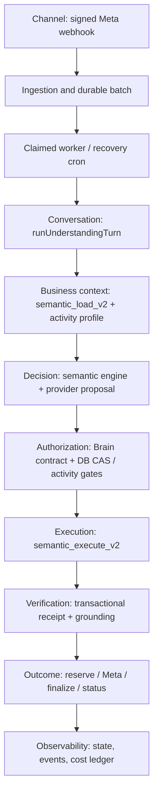

# DABBIR: authority map and incremental refactor

Status: PARTIALLY VERIFIED. This is an implementation ledger, not launch approval.

## Observed baseline

- Requested historical baseline: `eb826bca7f08b7b5b58bba06639f31b21a23c0c4`.
- Main and authenticated Production release observed at task start, 2026-09-10:
  `0ae7e93b54478c35fa3da55c8c8202e139b62b8b`, deployment
  `dpl_3De4C1Sy5etgSc6soyqjKYmh6hf5` (PR #695 greeting fix retained).
- Local baseline: 2716 tests, all passed, zero skipped.
- No replay of PRs #687–#693; #694 remains evidence-only.
- `baseline-call-map.json`: 288 API JS modules, 517 literal import edges,
  1445 top-level functions, zero import strongly-connected components.
  41 local unreachable candidates, including 24 in the old AI core and 16
  in the service-menu wrapper. Candidate status alone does not permit deletion.
- The AST audit includes literal dynamic imports and RPC call sites. It does
  not prove absence of externally deployed callers, dynamic SQL or reflective
  access. Read-only live `pg_proc` inspection confirmed the RPC boundaries below.

## Real request path

The diagram is the operational sequence, not an import layering claim.
The provider only proposes an interpretation. PostgreSQL remains authoritative
for state versions, tenant and branch scope, activity requirements and mutations.
The deployment topology remains the existing modular monolith plus PostgreSQL
and its existing scheduled/Edge adapters. No framework or service is added.

## Channel entrypoints and scope of convergence

| Channel / operation | Actual caller path | Shared authority today | Remaining separation |
|---|---|---|---|
| Meta customer message | Signed webhook → live-core ingestion RPC → durable worker/cron → claimed core → `runUnderstandingTurn` | Database batch/CAS/activity/execution boundaries | Legacy JS retained until deployed caller proof |
| Meta app contact/history/echo | Signed webhook → `_whatsapp-coexistence.js::persistCoexistenceEvent` → existing Coexistence RPCs | Signature/connection scope and event ledger | Customer resolver migration prepared in #701 |
| Human WhatsApp reply | `dabbir-whatsapp-reply.js` → owner authorization → reserve → `sendMetaText` → finalizer/readback | Shared text transport; DB reservation/receipt | Human attribution and approval remain at the human adapter |
| Reminder template | `salon-reminders-cron.js` → protected claim → `sendMetaTemplate` → notification finalizer | Shared template transport | Notification claim/outcome is a distinct operation |
| Web customer message | `app.js`, `chat-customer.js`, `mobile/chat-send.js` → `chat-send.js` | Auth/RLS, handoff policy, `_ai-core.js` provider | Separate catalog/read/reply logic; it does not call the WhatsApp Brain |
| Owner AI booking | `ai-business-operator.js` → `_dabbir-owner-booking.js` → `dabbir_owner_activity_booking_v1` | Activity/confirmation/appointment database guards | Quote/approval/idempotency entrypoint remains separate |
| Salon booking/update | `salon-operations.js` → quick-book/transition/rebook RPCs or authenticated appointment PATCH | RLS and mandatory appointment triggers | Operation semantics require per-operation consolidation |
| General runtime booking | `dabbir-runtime.js::createAppointment` → authenticated appointment POST | RLS and mandatory appointment triggers | Separate writer remains under investigation |

The full Production browser journey exercises the web/owner paths and protected
real-provider probes. It does not prove an actual customer Meta round trip.
Shared transport/worker behavior has separate isolated contract tests. Web reply
logic has not been silently replaced by the WhatsApp conversation pipeline.

Oversized-module inventory at the integrated pre-removal tree: daily operator
665 lines, runtime 602, embedded completion 532, customer activation UI 524,
embedded UI 514, web chat 482, embedded core 472, semantic engine core 471,
provider core 438 and fast runtime 435. Size is a review signal, not sufficient
reason to split a verified module. The Brain is not restructured for line count.

## Contracts and canonical owners

| Boundary | Current owner | Input → output | Allowed dependencies | Failure behavior | Verification |
|---|---|---|---|---|---|
| Meta authentication / ingestion | `dabbir-whatsapp-webhook.js`; Coexistence reuses `verifyMetaSignature` | Raw signed bytes → normalized text/location/voice/status event | Crypto, parsers, persistence adapters, safe telemetry | Invalid signature/raw body rejected before persistence | Webhook signature, raw-body, branch-routing suites |
| Durable inbound | SQL `dabbir_whatsapp_persist_inbound`; location/voice/Flow adapters | Provider ID + receiving phone ID → tenant-scoped conversation/message/batch IDs | Exact connection lookup, customer resolver, inbox tables | Unique provider event, incomplete or unverified persistence rejected | Real-DB ingestion and tenant isolation |
| Dispatch / recovery | `_dabbir-whatsapp-dispatch.js` delegates to `processClaimedWhatsAppAiBatch`; previous module retained | Opaque dispatch token / bounded recovery limit → claim state and outcome | Claim/finish RPCs and AI worker core | No work without DB claim; CAS conflicts cancelled, ambiguous sends handed off | Dispatch contract suite; full deployed journey |
| Conversation | `runUnderstandingTurn` in `_dabbir-understanding-orchestrator.js` | Claim + scoped context + explicit effect ports → decision/state/outcome | Semantic engine, Brain contract, cognitive/context helpers; injected RPC/delivery | Missing scope/requirements block mutation; proposal is not permission | Understanding, cognitive, greeting, real-DB concurrency suites |
| Business/activity/service facts | SQL `dabbir_activity_profile_v1` and private `activity_contract_v1`; JS `_dabbir-activity-intelligence.js` validates projection | Verified tenant/branch/service → versioned requirements/allowed actions | DB activity registry, verified facts/memory, exact service/worker scope | Missing/stale/unconfigured contract blocks operation | Activity authority/configuration/delivery-mode suites |
| Decision | `_dabbir-semantic-engine.js` + `_dabbir-semantic-interpreter.js` | Bounded redacted context + customer turn → typed proposal | Pure semantic helpers; metered provider interface | Invalid/uncertain proposal cannot authorize writes | Frozen understanding cases and contract tests |
| Authorization | `_dabbir-brain-contract.js`; SQL `understanding_assert_batch_v2`, `activity_assert_execution_v1` | Decision + matching scope/version/lock/confirmation → permitted action | Persisted state, account/membership, service contract | Fail closed on version drift, takeover, unsupported action or missing facts | Tenant/WhatsApp isolation, CAS/replay and confirmation tests |
| Booking execution | WhatsApp `dabbir_semantic_execute_v2` → existing create/cancel/reschedule RPCs; owner `_dabbir-owner-booking.js` → `dabbir_owner_activity_booking_v1` | Authorized typed action → transaction result | DB locks, idempotency ledger, appointments, activity assertions | Rollback on invalid scope, conflict or stale confirmation | Real PostgreSQL independent-session mutation/replay proof; owner booking tests |
| Verification / outcome | Transactional execution receipt, `verifiedAvailability`, `assertResponseGrounding`; outbound finalizer + signed statuses | Persisted receipt → scoped result and justified response | DB-returned facts only | Never claim mutation/delivery without corresponding evidence | Grounding, receipt, finalization, ambiguous readback tests |
| Customer persistence | Private `resolve_whatsapp_customer_v1` for text/voice; Coexistence still has an independent writer | Receiving tenant + provider handle → canonical customer ID | Customer/identity tables and uniqueness constraints | Scope mismatch/conflict fails closed | Canonical customer persistence and isolation tests; Coexistence debt retained |
| Provider abstraction | `_ai-core.js`; semantic interpreter calls metered interface | Bounded request + attribution → validated proposal/usage | Existing configured providers; budget/failover/meter | Bounded fallback, no invented zero cost or false success | Provider budget/failover/meter suites |
| Observability | `_observability.js`, AI meter, understanding events/state | Correlation + bounded redacted metadata → trace/usage records | Logs and accounting/event RPCs | Core evidence failures block truth claims; best-effort telemetry explicitly separate | Privacy/redaction, metric size and billing attribution tests |

Booking execution is **not yet one global writer**: owner, WhatsApp and other
operational adapters have distinct SQL entrypoints, some sharing guards/locks.
This is recorded as debt, not falsely renamed into a single authority.
RLS, authorization, tenant isolation and confirmation constraints remain at
their existing boundaries throughout the migration.

## Slice 1: text/template transport

Before: `_whatsapp-live-core.js` independently implemented two HTTP sends,
timeouts and provider outcome classifiers.

After: both public functions keep their existing prerequisite checks, payload
normalization, signatures and error codes, and call
`_whatsapp-message-transport.js::sendMetaMessage`.

Transport input is an already-authorized token/phone, exact wire message and
compatibility error names. Output is `{providerMessageId, providerStatus}`;
it means provider acceptance only. The transport performs one attempt, has a
10-second timeout, owns no DB writes, and never retries. A 5xx, missing receipt,
network TypeError or timeout remains ambiguous. A 4xx remains definitive.
Reservation, exact branch connection, finalization, signed status and
authenticated readback authorities are unchanged.

Catalog, Flows and an unreachable legacy interactive-list sender are still
separate implementations at this slice. No legacy path is deleted in slice 1.

Tests: 28 added behavioral cases exercise real exported text/template adapters,
exact wire payload, acceptance without delivery claim, 400/401/403/429/500/503,
malformed/missing receipts, network errors, precise timeout, capability denial
and OIDC template compatibility. Existing source-location assertion points at
the extracted classifier; its assertion is unchanged. Full local suite:
2744 passed, zero failed/skipped. Exact deployed CI passed 2752 cases after
concurrent main changes; the complete Production journey passed on its second
unchanged attempt. Both attempts are retained in the verification checkpoint.

## Before/after measurements

| Measurement | Baseline | Slice 1 | Interpretation |
|---|---:|---:|---|
| Text/template transport implementations | 2 | 1 | One shared timeout/outcome implementation |
| Transport implementation blocks to inspect per text/template transport bug | 2 | 1 | Static inspection count, not measured repair time |
| Source files to change for a common text/template transport defect | 1 | 1 | Both implementations previously lived in one file |
| `_whatsapp-live-core.js` lines | 331 | 256 | Extracted transport owns 55 lines separately |
| API JS import cycles | 0 | To be regenerated | Literal import graph only |
| Isolated transport behavior cases | 0 in dedicated suite | 28 | No DB/model/Meta credentials required |
| Mutation/security files changed | 0 | 0 | No migration, RLS, auth, Brain or reservation edits |
| Owner lookup time / actual files touched per future bug | Not measured | Not measured | No fabricated productivity percentage |

## Next slices and deletion gate

1. Unify remaining active Meta transport implementations with compatibility
   tests for their distinct failure metadata and durable Flow receipts.
2. Migrate dispatch/recovery callers onto one owner with explicit legacy default
   preservation. Keep compatibility wrappers until exact-SHA Production journey
   and regression tests pass.
3. Remove proven unreachable local planner, booking and rendering functions only
   after the caller migration has been Production verified. Replace misleading
   source-only legacy tests with behavioral assertions on the live authority.
4. Inventory every live SQL writer and external Edge caller before consolidating
   owner/WhatsApp/other booking or customer writers. Do not remove SQL functions
   based solely on repository search.

Every deployment must retain required CI/mobile/security gates, exact release
identity before/after the full Arabic/English iPhone/iPad journey, and isolation
checks. A real-phone Meta round trip is a separate acceptance item and is not
claimed by mocked transport or protected Production journey evidence.

## Slice 2: canonical dispatch owner (migration, no deletion)

The public worker and recovery cron now import
`_dabbir-whatsapp-dispatch.js`. Its claim/wait/recovery and failure functions are
copied byte-for-byte from the existing active service-menu wrapper, keeping
its default recovery limit of 12, cap of 25, claim lock, failure mapping and
fallback behavior. The old module is retained unchanged for the deletion gate.
No decision/Brain behavior or SQL is changed.

18 executable contract cases cover non-claims, WAIT re-claim, denied context,
claim storage failure, recovery termination, exact lock propagation and limits.
Four architecture gates prevent a new transport dependency, direct provider
access from the Brain, divergence between worker/cron owners, and introduction
of another direct Meta messages sender outside the explicit migration inventory.

`live-sql-ownership.json` records a read-only catalog scan of 227 live functions
with qualified calls/writes. A shared table is not proof of duplicated business
logic: privacy cleanup, name editing, payment status triggers and appointment
creation are different operations. Dynamic SQL and unqualified calls are
explicit blind spots. No database object is removed based on this scan.

Production verification of this slice must complete before removing the old
service-menu module or the AI core's unreachable local functions. Temporary
source duplication during caller migration is intentional and time-bounded by
that gate; no second dispatcher is enabled by the worker/cron.

## Slice 3: all active message HTTP attempts

Text, templates, catalog products and booking Flows now use the single
`requestMetaMessage` HTTP owner in `_whatsapp-message-transport.js`. It preserves
the exact normalized payload, authentication headers, 10-second deadline and
one-attempt behavior. Catalog read APIs and Flow provisioning are different
operations and retain their existing adapters. Domain-specific error names,
provider diagnostics and Flow session finalization remain compatible.

19 additional behavioral tests cover catalog wire payload, tenant-bound Flow
session before send, token-hash correspondence, receipt-before-sent ordering,
4xx/5xx, malformed responses, network failures and timeout. The architecture
inventory removes catalog/Flow exceptions, so neither can regain a direct
messages endpoint. The sole remaining direct-send exception is the retained,
unreachable legacy service-menu implementation awaiting the deletion gate.

Local full suite at this slice's original base: 2785/2785, zero failures/skips.
Concurrent main added eight direct-return-to-AI UI cases; required CI on the
rebased branch verifies those changes too. No Brain, authorization, database,
confirmation, branch selection, reservation or delivery-status behavior changes.

## Slice 4: Coexistence customer identity authority

Read-only Production inspection proved the contact/history writers bypassed
`dabbir_private.resolve_whatsapp_customer_v1`, the current text/voice resolver.
An isolated PostgreSQL reproduction using the deployed definitions fails with
23505 when an owner-created phone-only customer receives a contact sync. The
same call through the existing resolver reuses that customer. This is a proven
identity defect; the resolver and name-protection trigger are unchanged.

The two existing service-only Coexistence RPC signatures now call that resolver
and then add their channel metadata. No customer backfill/deletion, schema,
RLS, connection selection, signature verification, ledger, idempotency or
privilege expansion is included. The migration also qualifies ambiguous tenant
columns in the existing echo/mutation updates: the previous echo call fails
with 42702 under Production's verified `plpgsql.variable_conflict=error`.
The predicates and intended handoff/batch behavior remain the same.

Input: existing authenticated service RPC arguments; connection determines
business/branch, normalized handle determines customer. Output: the same RPC
JSON/row shapes with the canonical customer ID. Dependencies: existing private
resolver and name guard, tenant-scoped customer/conversation/event tables.
Failure: reject unknown/disconnected connection, wrong service role and split
phone/handle identity; PostgreSQL rolls back the whole failed statement.

12 isolated PostgreSQL cases cover the two before/after reproductions, shared
text/voice/contact/history identity, explicit owner-name priority, provider name
refresh, tenant/branch separation, replay, conflicting identity, removal and
re-add, app echo/handoff, pending edits, service-only privileges and retained
RLS flag. The fixture models relevant constraints and actual function/trigger
bodies; it does not replace the existing Production isolation gate.

This PR is prepared in the sequence after slices 1–3. Database application and
Production verification must be recorded before calling this slice verified.

## Database side effects and remaining operation owners

`trigger-callers.json` records 27 enabled trigger callers on the critical live
tables. Appointment creation/update is already serialized by
`lock_booking_calendar_business`; shared triggers enforce calendar conflicts,
branch resources, past-time rules, deposit snapshots and confirmation gates.
The activity invariant is an INSERT trigger. These are existing authorities,
not newly introduced refactor abstractions. Workflow, calendar outbox, funnel,
operator and recovery capture are hidden write side effects of an appointment
change and must be included in future mutation tests.

Owner, WhatsApp, salon and other operational writers still have distinct
entrypoints. In addition to SQL RPCs, `salon-operations.js::patchAppointment`
writes the appointment through authenticated REST, preserving RLS and triggering
the common database invariants. REST writer candidates also exist in clinic,
home-service, adaptive appointment, calendar and runtime modules; a shared table
name alone does not prove duplicated operation semantics. No existing writer is
declared dead or removed without per-operation caller/contract proof.

The prepared audit can be repeated with:
`node scripts/dabbir-architecture-audit.mjs working /tmp/dabbir-call-map.json`.
It uses the parser shipped in the pinned Node 24 runtime, introduces no production
dependency, and fails on import cycles. Its local reachability is conservative
and limited to top-level function declarations; nonliteral imports/eval are
listed as hazards. It is an inspection tool, not an automatic deletion tool.
Pre-removal tree: 290 API JS modules, 522 literal import edges, zero cycles, 41 local
unreachable candidates. The complete 2822-test integrated local suite passes, zero skipped, including
the concurrently deployed independent-read fix without alteration.
Eight new worker cases exercise the actual claimed worker and versioned executor,
so future legacy deletion cannot rely only on matching strings in dead code.

`verification-checkpoint.json` retains exact deployment/run/artifact identity,
including failed attempts. A failed model probe remains failed; successful
Arabic/iPhone stages do not convert the complete iPad/isolation gate into PASS.

Five service-presentation cases exercise tenant services/prices, receipt-bound
presentation, stale/foreign choices and read-only side questions on the actual
conversation authority. These replace no security or Production gate.

Slice 2 functional journeys all passed, including 13 isolation checks, but its
first final release identity check failed because concurrent main advanced to
`4ef4fb47ac7474757ce8b5972a14b4293501a7b6`. The subsequent complete journey on
that exact current-main SHA passed Arabic, iPhone, iPad, 13/13 isolation and
stable release identity (run 34455759835, artifact 10144266397). This allowed
the next transport merge and preparation of the separate legacy deletion PR.

## Slice 5: proven superseded WhatsApp paths

After deployed caller proof, the cleanup branch removes the 287-line service-menu
module, 24 unreachable private AI-core functions and its two unused dispatch
exports. The core shrinks from 297 to 137 lines.
The 13 retained function bodies have identical SHA-256 hashes before/after;
`legacy-removal-proof.json` records them. No live SQL RPC or Brain implementation
is removed. The direct meter import is redundant with the active semantic
interpreter's existing meter import; provider metering remains active.

`post-removal-call-map.json`: 289 API modules, 513 import edges, no cycles,
1405 top-level functions and one remaining local unreachable candidate.
The initial task baseline was 288/517/1445/41 respectively. The pre-removal
slice tree was 290/522/1453/41. No actual repair or owner-lookup time is claimed.

| Retired source-only assertion | Active behavioral replacement |
|---|---|
| Old planner prompt/guard/ledger strings | Structured contract and Brain guard execution; scoped worker ledger and telemetry failure tests |
| Old interactive-list renderer and time-first question | Current tenant prices, receipt-bound choices, foreign/stale selection and activity-required question tests |
| Old unversioned slot create/cancel/reschedule strings | Actual worker → versioned semantic executor; PostgreSQL CAS/replay/confirmation suites |
| Old planner history/raw reply filtering | Native role-history privacy and invalid semantic-provider contract tests |
| Old direct meter import/context strings | Active core → semantic interpreter → meter attribution checks and existing cost behavior tests |
| Old recent-booking helper string | Actual SQL scoped history filtering and stale-history rejection before mutation |
| Old catalog-list fallback strings | Active native product/Flow transport, foreign/multiple product routing and receipt-bound text fallback tests |

Eight obsolete source-only test cases were removed/replaced while preserving
their applicable invariants at the actual execution boundaries. The full local
suite after those replacements passed 2815/2815; the subsequent new architecture
gate passed with its five-case suite. Required CI repeats the complete suite.
The lower test count is explicitly retained, not hidden as a test-gate success.
No CI/security/Production acceptance check, retry limit or authorization gate is
relaxed. The cleanup is not Production verified until its own release completes.

The later concurrent presented-delivery fix `a3cfe51bffd487e708bf1a1bce3a8a61229f8bbd`
was integrated unchanged into the prepared branches. Complete local regression
then passed 2826/2826. Slice 3 also passed all functional Production journeys and
13 isolation checks, but its final SHA check failed due to that concurrent
deployment; run 34458663288 re-verifies the current release before further rollout.

Audit correction: parameter-default expressions are real callers. Three helpers
(`budgetRpc`, its credential resolver and `adminRest`) were incorrectly counted
as unreachable by the initial body-only scan. They were never deleted. The
corrected baseline/pre-removal candidate count is 41, and the prepared cleanup
count is one. Rechecking the actual deleted WhatsApp functions gives the same
24 private functions and two externally unreferenced exports. Two regression
tests now protect parameter-default reachability and self-import cycle detection.
