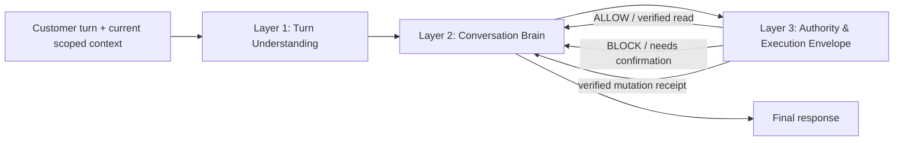

# DABBIR Conversation Three-Layer Architecture — Rebuilt Phase 1 Design

**Date:** 2026-09-11  
**Status:** DESIGN ONLY — NO BEHAVIOR CHANGE  
**Baseline:** `main@e080d35479da0db6c645043096dedf8bebebb1b9`  
**Repository:** `barman-systems/pilot` (Private)  
**Rollout boundary:** existing `cognitive_mode` / `canary_percent`  
**Scope owner:** conversation understanding + dialogue only

---

## 0. Why this document exists

This document replaces an earlier local-only three-layer design that was never pushed to the repository. The previous local ref (`feat/conversation-three-layer-phase1-20260910` / `e064024`) is not available in the current remote repository, so this design is rebuilt from the live production architecture and the real WhatsApp evidence observed on 2026-09-11.

This is not a patch plan for one phrase. It is an architecture plan to remove the structural conditions that caused the observed failure.

The governing rule is:

> **One brain owns the dialogue decision and the final response. Other layers may interpret, validate, allow, block, or return verified outcomes; they never rewrite the conversation.**

No code should implement this document until the owner reviews and approves it.

---

## 1. Non-negotiable scope

### Rebuilt

Only the conversation layer is rebuilt:

- current-turn semantic understanding;
- extraction of facts, corrections, references, side questions, and user goals;
- conversation state transition logic;
- dialogue planning;
- composite responses;
- next-question selection;
- conversation-level shadow/canary routing.

### Frozen / reused unchanged

The following remain authoritative and are not redesigned by this phase:

- Supabase schema and existing production tables;
- tenant / customer / branch identity;
- canonical conversation state storage and CAS/version protection;
- Meta WhatsApp webhook, signature verification, ingest, durable batches, recovery, and outbound delivery;
- activity registry and activity contracts;
- service catalog and branch scoping;
- booking / reschedule / cancellation execution RPCs;
- verified execution receipts;
- RLS and database authorization;
- billing and AI cost accounting;
- audit and observability infrastructure;
- Customer Journey and release gates fixed on 2026-09-11;
- Release Guardian behavior;
- provider abstraction and provider fallback order.

This phase must not add a new database, framework, transport, billing path, or execution authority.

---

## 2. Production evidence that defines the problem

### 2.1 Real WhatsApp transcript

Observed on Production `e080d354`:

```text
Customer: اذا فاضي تعال غسل السياره الحين
DABBIR:   أكيد. أي خدمة تبي بالضبط؟

Customer: غسيل خارجي
DABBIR:   تمام. أي سيارة نخدم لك؟

Customer: الاستيشن
DABBIR:   تمام. أي سيارة نخدم لك؟
```

The same failure repeated with:

```text
Customer: استيشن
DABBIR:   تمام. أي سيارة نخدم لك؟
```

A later `نفس قبل` also failed because no vehicle fact had been persisted to resolve.

### 2.2 What worked

The production state proves that the recent `الحين` / single-delivery-mode work was effective:

- the immediate request was grounded to the real message time in the business timezone;
- `date` and `time` were retained as customer-stated facts;
- after `غسيل خارجي`, the scoped service was retained;
- the single authorized delivery mode was retained as `MOBILE` from `DATABASE_FACT`;
- the system did not ask for delivery mode again.

Therefore this incident is not evidence that PR #709 should be reverted.

### 2.3 Where `الاستيشن` was lost

The failure occurred before persistence of the vehicle fact.

The current semantic core contains a closed parser that recognizes forms such as:

```text
ستيشن | station | suv | 4x4 | دفع رباعي | جيب
```

but does not recognize:

```text
استيشن
الاستيشن
```

The same parser is also used as a grounding check for model-proposed vehicle entities. As a result, both the deterministic path and the AI proposal path can reject the same valid Gulf-Arabic meaning.

The canonical state after the failed turn still contained service, delivery mode, branch, date, time, and price, but no `vehicle` entity. `vehicle` therefore remained missing and the planner asked the same question again.

### 2.4 Current dialogue ownership problem

The current effective chain is:

```text
understandCore
  -> understandLegacyConversation
  -> cognitiveReduce
  -> applyGoalDrivenConversationPlan
```

The final planner is downstream of the cognitive reducer and can replace a generic clarification with its own chosen focus and wording.

`chooseFocus()` normally reduces missing information to one `first` field, with a narrow date+time exception. This creates a structural form-filling tendency and makes the downstream planner the last writer of conversation text.

### 2.5 The three proven defect classes

Phase 0 therefore establishes three independent defects:

1. **Open-language extraction defect** — a closed lexical validator can discard valid customer meaning.
2. **Dialogue-shape defect** — the architecture usually asks one missing field at a time.
3. **Ownership defect** — more than one layer can influence or rewrite the dialogue decision; the last planner can flatten richer reasoning into a generic question.

These are architecture defects, not one bad regex.

---

## 3. New linguistic rule: open vocabulary, closed authority

This is a hard design constraint.

### 3.1 Forbidden pattern

The new path must not use a hand-written closed word list as the **final semantic validator** for business entities.

A phrase must not become “nonexistent” merely because an engineer did not prewrite its dialect or brand form.

Examples that must be treated as a class, not isolated exceptions:

- `الاستيشن`
- `استيشن`
- `جيب شيروكي`
- `وانيت`
- `كامري`
- future Gulf-Arabic spellings or vehicle descriptions not known when the code was written.

Regex remains allowed for protocol syntax, security patterns, bounded normalization, obvious machine formats, and defensive parsing. It is not allowed to be the final authority for the meaning of an open natural-language entity.

### 3.2 Required pattern

The new architecture separates:

```text
what the customer said
        ↓
semantic candidate
        ↓
validation against CURRENT scoped business data
        ↓
verified fact OR tentative fact requiring correction
```

Validation is driven by live scoped data already supplied by DABBIR:

- `activity_profile`;
- `entity_definitions`;
- allowed enum values;
- scoped service catalog;
- scoped workers;
- branch scope;
- owner-approved aliases;
- verified memory;
- provider-verified receipts where required.

### 3.3 “Unknown” is not “absent”

A semantically plausible fact that cannot yet be operationally verified must survive as a **tentative candidate**.

It must not silently disappear and turn into a generic “what vehicle?” question.

Example:

```text
Customer: وانيت
```

If the activity contract only supports canonical categories `saloon` and `station`, the new path should preserve:

```json
{
  "field": "vehicle",
  "surface": "وانيت",
  "candidate_value": null,
  "resolution": "TENTATIVE",
  "reason": "NO_UNIQUE_ALLOWED_CATEGORY"
}
```

The dialogue brain can then ask a correction question grounded in what it understood, for example:

```text
فهمت إن السيارة وانيت، لكن تصنيف السعر عندنا صالون أو ستيشن/SUV. أي فئة نعتمد؟
```

That is categorically different from pretending the customer supplied no vehicle information.

### 3.4 Resolution levels

Every extracted business fact uses one of these statuses:

- `VERIFIED` — valid against authoritative scoped data and safe for the current conversational purpose;
- `TENTATIVE` — meaning was understood but operational mapping still needs confirmation;
- `CONFLICT` — explicit customer meaning conflicts with the business contract or another stronger current fact;
- `UNRESOLVED_REFERENCE` — customer clearly referenced earlier context but the target cannot be resolved uniquely;
- `INVALID_FORMAT` — only for true structural invalidity such as impossible coordinates/date shape, never merely unfamiliar wording.

No candidate is discarded solely because its surface form is unfamiliar.

---

## 4. Target architecture



Only Layer 2 produces customer-facing dialogue.

Layer 1 never chooses the final response.
Layer 3 never writes customer-facing prose.

---

# Layer 1 — Turn Understanding

## 5. Responsibility

Layer 1 answers only:

> **What did the customer communicate in this turn?**

It does not decide the final action, does not select a booking tool, and does not write the reply.

### Inputs

- current customer message(s) in the durable batch;
- current conversation snapshot;
- previous confirmed facts;
- pending question metadata;
- scoped business/activity/service context;
- scoped catalogs and owner-approved aliases;
- business timezone;
- recent bounded conversation history.

### Output

A typed `TurnUnderstandingV3` object, for example:

```js
TurnUnderstandingV3 = {
  role,                    // answer, correction, side question, new request, etc.
  goals: [],
  facts: [
    {
      field,
      surface,             // exact current-message evidence
      candidate_value,
      confidence,
      resolution,          // VERIFIED | TENTATIVE | CONFLICT | ...
      correction,
      invalidates: []
    }
  ],
  side_questions: [],
  references: [],
  withdrawals: [],
  request_spans: []
}
```

It contains **no final customer reply** and **no execution authority**.

---

## 6. Semantic extraction rules

### 6.1 Extract all facts in the turn

Layer 1 must process the whole turn, not stop when it finds the first requirement.

A message such as:

```text
إذا فاضي الحين تعال غسل السيارة، أبي خارجي والسيارة كامري وكم السعر؟
```

may produce in one pass:

- booking goal;
- immediate time;
- mobile-service signal;
- service candidate;
- vehicle candidate;
- pricing side question.

No downstream layer is allowed to pretend only the first fact existed.

### 6.2 Evidence is mandatory

Each customer-derived candidate must point to exact current-message evidence.

The model may propose meaning; it may not fabricate a phrase or a business identifier.

### 6.3 Dynamic entity validation

Validation depends on `entity_definitions.type` and scoped business data.

#### `ENUM`

Examples: vehicle class, delivery mode.

- canonical result must map to a currently allowed `entity_definitions.values` value;
- exact canonical values and owner-approved aliases may be `VERIFIED`;
- a semantic mapping with no authoritative alias is retained as `TENTATIVE` unless the business policy explicitly makes that mapping authoritative;
- an unfamiliar surface form is never discarded;
- a value outside the allowed set becomes `TENTATIVE` or `CONFLICT`, not “missing text”.

#### `CATALOG_REFERENCE`

Examples: service.

- resolve only against the current scoped branch/service catalog;
- exact label, localized label, or owner-approved alias may resolve directly;
- semantic similarity may produce a tentative candidate;
- more than one plausible service remains ambiguous and must be exposed for clarification.

#### `SCOPED_REFERENCE`

Examples: worker, appointment, branch.

- must resolve to an identifier already present in the current server-scoped context;
- the model never supplies trusted IDs;
- cross-tenant / cross-branch references fail closed.

#### `VERIFIED_GPS`

- text such as “هذا موقعي” never invents coordinates;
- authority still requires the existing signed/provider-verified location receipt or verified stored memory;
- natural-language location text may be understood as a tentative request context but cannot satisfy execution location authority by itself.

#### `DATE` / `TIME`

- semantic extraction may interpret Gulf-Arabic time language;
- final value must be valid in the business timezone;
- deterministic date/time parsing can remain as a helper, but unknown wording is not rejected merely because it misses a phrase list;
- impossible values are structural invalidity, not semantic uncertainty.

#### `TEXT`

- preserve bounded customer text when the current activity contract permits it;
- apply length/security constraints without converting vocabulary diversity into absence.

---

## 7. Tentative candidate lifecycle

A tentative fact is non-authoritative but durable enough for the current dialogue to reason about.

It must support this lifecycle:

```text
CUSTOMER WORDING
   ↓
TENTATIVE semantic candidate
   ↓
shown back / clarified once
   ↓
CUSTOMER_CONFIRMED or corrected
   ↓
authoritative conversation fact
```

It must not support this lifecycle:

```text
CUSTOMER WORDING
   ↓
unknown regex
   ↓
discard
   ↓
ask the same generic question again
```

No database schema migration is required for Phase 1. Existing JSON state can carry non-authoritative candidate metadata without granting execution authority.

---

# Layer 2 — Conversation Brain

## 8. Responsibility

Layer 2 is the single owner of:

- the active customer goal;
- state transition for this turn;
- fact retention and invalidation;
- handling of side questions;
- deciding what information should be surfaced;
- deciding whether to ask a question;
- selecting the one next conversational question when needed;
- the final `DialoguePlan`;
- final customer-facing wording.

No later conversation planner may rewrite its output.

---

## 9. Mandatory turn order

The new brain must execute this order:

```text
1. Load previous canonical state
2. Apply ALL verified current-turn facts
3. Apply ALL explicit corrections / withdrawals
4. Retain tentative candidates separately
5. Recompute activity requirements ONCE from the resulting state
6. Resolve side questions and known business answers
7. Decide proposed operational action, if any
8. Build one DialoguePlan
9. Send to authority envelope
10. If envelope blocks, replan once from the structured block reason
11. Render final response
```

The architecture must never do:

```text
understand -> ask first field -> second reducer -> planner rewrites -> repair -> another planner
```

---

## 10. Fact-retention invariant

A fact that is confirmed before or during the turn cannot disappear silently.

For every fact `F`:

```text
if F is verified at turn start
or F becomes verified from current customer evidence
then F must still exist at turn end
unless there is an explicit invalidation reason.
```

Allowed invalidation reasons are bounded and auditable, for example:

- `CUSTOMER_CORRECTION`;
- `CUSTOMER_WITHDRAWAL`;
- `CONTRACT_CHANGED`;
- `CATALOG_ITEM_REMOVED`;
- `SCOPE_CHANGED`;
- `MEMORY_EXPIRED`;
- `VERIFIED_CONFLICT`.

A planner changing focus is **not** an invalidation reason.
A provider returning a different guess is **not** an invalidation reason.
A missing regex synonym is **not** an invalidation reason.

If a previously verified fact is absent at turn end without an allowed invalidation reason, the turn fails closed as an architecture violation.

---

## 11. No “first missing field” dialogue model

`missing_fields` remains useful for execution readiness, but it is no longer a scripted questionnaire.

The brain considers the whole situation and may:

- surface several known facts together;
- answer a side question;
- state one tentative assumption;
- request one correction;
- ask one natural combined question for closely related information;
- take a safe read action before asking anything when enough facts exist.

The brain must not expose a sequence merely because the activity contract stores a collection order.

Business requirements define **what must be true before execution**, not **how many chat turns the customer must endure**.

---

## 12. DialoguePlan contract

The brain emits one structured plan:

```js
DialoguePlanV3 = {
  goal,
  state_delta,
  surfaced_facts: [],
  tentative_facts: [],
  answers: [],
  corrections: [],
  proposed_action,
  required_confirmations: [],
  next_question: null | {
    fields: [],
    purpose,
    text
  },
  response_parts: {
    acknowledgement: null,
    understanding_summary: null,
    answer: null,
    assumption: null,
    execution_result: null,
    question: null
  }
}
```

### Hard constraints

- at most **one user-facing question** in one response;
- the question may cover multiple naturally related facts;
- a side question that can be answered from verified business data is not dropped because booking facts are missing;
- no question may request a fact already verified in the resulting state;
- tentative facts must be surfaced when correction is needed;
- the final response is generated only here.

---

## 13. Composite response behavior

The target interaction is not a form.

Example after the system understands service + mobile + immediate time + vehicle:

```text
تمام، فهمت: غسيل خارجي متنقل والحين، والسيارة ستيشن. باقي موقعك بس — أرسله من خيار الموقع في واتساب.
```

If a semantic vehicle mapping is tentative:

```text
تمام، غسيل خارجي متنقل والحين. فهمت إن الجيب شيروكي نحسبه ستيشن/SUV — صح؟
```

If the customer also asked a price question:

```text
الغسيل الخارجي 40 درهم. وفهمت إنك تبيه متنقل والحين لسيارة ستيشن؛ باقي موقعك بس — أرسله من واتساب.
```

The response can therefore include:

```text
acknowledgement + verified answer + understood facts + assumption/correction + one next question
```

instead of one generic field prompt.

---

## 14. Response ownership rule

The new V3 path must have exactly one response writer.

Forbidden downstream behavior:

- `qualityGate` replacing prose;
- goal planner replacing prose;
- activity requirements generating prose;
- execution guard generating prose;
- provider adapter generating final customer prose outside the brain;
- transport layer altering dialogue wording.

Those components may return structured facts/reasons only.

If a guard rejects a proposed action, it returns a structured result to Layer 2, such as:

```js
{
  status: 'BLOCKED',
  code: 'LOCATION_NOT_VERIFIED',
  required_fields: ['location']
}
```

Layer 2 then owns the resulting question.

---

# Layer 3 — Authority & Execution Envelope

## 15. Responsibility

Layer 3 answers only:

> **Is this plan authorized, and what verified result actually occurred?**

It does not decide conversational style and does not write the reply.

### Existing authority reused

The V3 path must reuse, not replace:

- exact business/customer/conversation/branch scope;
- `activity_profile` from database facts;
- service contract `supported_actions`;
- activity requirements;
- `assertBrainDecision`-equivalent decision validation;
- CAS/current semantic version checks;
- verified slot rules;
- customer confirmation rules;
- `dabbir_semantic_execute_v2` and existing guarded mutation paths;
- verified availability checks;
- execution receipts;
- response grounding against verified receipts;
- outbound reservation/idempotency and provider delivery receipts.

### Output

Layer 3 returns only a structured `GuardResult` / `ExecutionResult`:

```js
{
  status: 'ALLOWED' | 'BLOCKED' | 'NEEDS_CONFIRMATION' | 'VERIFIED_RESULT',
  code,
  required_fields: [],
  verified_result: null | {...}
}
```

No free-form reply is produced here.

---

## 16. Mutation-response safety

The new architecture must preserve the current safety property that successful action language cannot exist without a verified receipt.

A model is not allowed to invent success after mutation.

For mutation turns, the brain may prepare a structured response specification before execution, but the execution-result portion is filled only from the verified receipt.

Example:

```text
DialoguePlan: "If CREATE_BOOKING succeeds, report verified booking time."
Execution: verified receipt
Brain renderer: "تم الحجز ✅ الساعة 9:00."
```

If execution fails, the success fragment never exists.

The renderer belongs to the Conversation Brain layer even if its implementation is deterministic.

---

## 17. Provider role

The provider remains an interpreter, not an authority.

The new path should reuse the current metered provider abstraction and fallback infrastructure. It must not require the Gateway branch or punctuation branch to be merged.

Phase 1 should target **no increase in provider calls per ordinary turn** relative to the current bounded semantic call.

A future language-polish model is permitted only if it lives inside the Conversation Brain and cannot change facts/actions; it is not part of Phase 1 acceptance.

Provider failures remain separately classified:

- 429 / provider timeout: reliability/capacity problem;
- invalid semantic result: interpretation failure;
- neither one is allowed to create execution authority.

---

## 18. Rollout model

The existing `cognitive_mode` control remains the rollout authority.

### `off`

- existing legacy path only;
- no V3 evaluation;
- emergency rollback state.

### `shadow`

- customer receives existing production response;
- V3 runs side-by-side without action or outbound authority;
- V3 result is compared with existing path;
- no V3 mutation may execute.

### `canary`

- existing database percentage bucketing controls which conversations receive V3;
- non-selected conversations remain on shadow/legacy behavior;
- V3 uses the same database/tool/transport authority boundaries.

### `active`

- V3 conversation path is customer-facing for the activity;
- legacy path remains available for rollback until decommission is separately approved.

Rollback is operationally simple:

```text
canary_percent -> 0
or cognitive_mode -> shadow/off
```

No database rollback is required merely to disable V3.

---

## 19. Integration rule: legacy files are frozen

During the V3 build, the following existing behavior modules are treated as **frozen legacy**:

- `api/_dabbir-semantic-engine-core.js`
- `api/_dabbir-semantic-engine.js`
- `api/_dabbir-cognitive-dialogue.js`
- `api/_dabbir-goal-driven-planner.js`

They may receive no functional “V3 fix” that gradually converts them into the new architecture.

The V3 implementation must be new and parallel.

Expected new modules, subject to implementation review:

```text
api/_dabbir-conversation-v3-contract.js
api/_dabbir-conversation-v3-understanding.js
api/_dabbir-conversation-v3-resolver.js
api/_dabbir-conversation-v3-brain.js
api/_dabbir-conversation-v3-renderer.js
api/_dabbir-conversation-v3-pipeline.js
```

A minimal routing seam may be added to the existing orchestrator so it can choose legacy versus V3 based on the existing rollout policy. The orchestrator must not absorb V3 dialogue logic.

No SQL migration is part of Phase 1.

---

## 20. Shadow observability

V3 shadow evidence must be inspectable without storing chain-of-thought.

For each real turn we need to correlate:

```text
inbound message
previous canonical state
V3 interpretation summary
V3 state delta
V3 DialoguePlan summary
GuardResult
actual outbound message / provider message id
```

Raw customer text already exists in the normal message tables and must not be duplicated into telemetry unnecessarily.

Existing understanding-event and canonical-state mechanisms may carry bounded V3 metadata, for example:

- fields detected;
- verified fields;
- tentative fields;
- invalidated fields and reason codes;
- goal;
- side-question type;
- proposed action;
- next-question fields;
- repeated-question violation;
- lost-fact violation;
- provider/model/latency classification.

No chain-of-thought is logged.

---

# Verification program

## 21. Acceptance invariants

Every stage uses these architecture-level assertions:

### A. No silent fact loss

If a fact is verified during a turn and disappears without a valid invalidation reason:

```text
FAIL_ARCHITECTURE: FACT_LOST_WITHOUT_INVALIDATION
```

### B. No repeated confirmed question

If the final plan asks for a fact already verified in the resulting state:

```text
FAIL_ARCHITECTURE: ASKED_CONFIRMED_FACT
```

### C. Tentative facts are visible

If Layer 1 produced a meaningful tentative fact and Layer 2 neither uses it nor exposes it for correction:

```text
FAIL_ARCHITECTURE: TENTATIVE_FACT_DROPPED
```

### D. One dialogue writer

If any downstream guard/planner returns new customer prose:

```text
FAIL_ARCHITECTURE: MULTIPLE_RESPONSE_OWNERS
```

### E. At most one question

A final response containing multiple independent customer questions fails unless the question is one natural combined request for related facts.

### F. Side questions survive

A verified answerable side question must be answered even when the active business goal has missing execution requirements.

### G. Execution stays fail-closed

No conversational improvement can weaken tenant, branch, service, confirmation, location, slot, receipt, or mutation authority.

---

## 22. Required real-WhatsApp corpus

The real phone corpus must include, at minimum:

### Original incident

```text
اذا فاضي تعال غسل السياره الحين
غسيل خارجي
الاستيشن
```

### Dialect / open-vocabulary vehicle class

```text
استيشن
الاستيشن
جيب شيروكي
وانيت
كامري
السيارة الكبيرة
```

Expected behavior is not “map every phrase automatically.” Expected behavior is:

- never lose the phrase;
- resolve confidently when authoritative mapping exists;
- otherwise retain it as tentative and ask a grounded correction once.

### Multi-fact turn

```text
أبا غسيل خارجي الحين، سيارتي كامري
```

The system must not ask for service and then vehicle in separate turns if both were understood in the same turn.

### Side question during booking

```text
أبا غسيل خارجي الحين، وكم السعر؟
```

The system should answer verified price and continue the active booking naturally.

### Correction

```text
لا قصدي جيب شيروكي
```

The correction must invalidate only the relevant vehicle candidate/fact, not reset the whole booking goal.

### Reference

```text
نفس السيارة قبل
```

A resolvable verified memory/reference is reused; an unresolvable one is presented as uncertainty rather than fabricated.

### Location

Use a real WhatsApp location message. Typed location text must not be silently promoted to provider-verified coordinates.

---

# Phased delivery

## 23. Phase 0 — Evidence and root cause

**Status: COMPLETE**

No behavior code changed.

Proven:

- immediate time and single delivery mode work;
- `الاستيشن` / `استيشن` did not become a vehicle fact;
- the current closed parser rejects that vocabulary class;
- the same semantic parser is used to validate model proposals;
- the final planner then chooses `vehicle` and emits the repeated generic question;
- the current planner has a first-missing-field architecture in the general case;
- the current conversation has multiple effective dialogue owners.

No regex repair is authorized as the solution.

---

## 24. Phase 1 — Understanding V3 in shadow

### Build

- new V3 interpretation contract;
- new dynamic resolver against current scoped catalogs / `entity_definitions` / aliases;
- tentative-fact lifecycle;
- no V3 customer-facing response;
- no V3 tool execution;
- old production path remains customer-facing.

### Real WhatsApp proof

Send the Phase 0 transcript plus open-vocabulary variants through the real Meta-connected car-wash activity.

### Required evidence

For each real message, compare:

```text
old interpretation
V3 interpretation
canonical business context
```

### Gate

Phase 1 cannot pass until V3 proves on real WhatsApp:

- `الاستيشن` is not discarded;
- `استيشن` is not discarded;
- `جيب شيروكي`, `وانيت`, `كامري` produce verified or tentative candidates, never silent absence;
- all existing scope and authority rules remain unchanged;
- no V3 outbound or mutation occurred.

---

## 25. Phase 2 — Conversation Brain V3 in shadow

### Build

- atomic whole-turn state transition;
- fact-retention invariant;
- side-question handling;
- composite `DialoguePlan`;
- one response writer;
- one-question maximum;
- guard feedback loop as structured data only.

V3 still does not control the customer-visible response.

### Real WhatsApp proof

Run the real phone corpus again while comparing:

```text
actual legacy reply
V3 shadow DialoguePlan
```

### Gate

Required V3 shadow plans must demonstrate:

- no repeated `vehicle` question after a resolved vehicle;
- no loss of service/date/time/delivery mode;
- price side question answered without abandoning booking;
- multi-fact messages do not degrade into one-field-per-turn plans;
- tentative vehicle mapping is surfaced for correction;
- one and only one customer-facing question in the proposed reply.

---

## 26. Phase 3 — User-visible canary

### Preconditions

- Phase 1 and Phase 2 real-phone evidence passed;
- existing CI / security / Customer Journey gates are green;
- no unresolved authority regression;
- current real activity traffic is checked before changing canary exposure.

### Rollout

Use the real Meta-connected car-wash activity.

Set the smallest practical `canary_percent` that includes the owner test conversation. Because the existing rollout bucket is conversation-based, determine the test conversation bucket before selecting a percentage; do not blindly expose 100% if unrelated customer traffic is active.

### Failure rule

At the first architecture regression:

```text
canary_percent -> 0
or mode -> shadow
```

before any repair attempt.

### Gate

The original incident must pass repeatedly in clean conversation episodes, not once.

---

## 27. Phase 4 — 100% on the approved test activity

After canary stability, move the approved car-wash activity to V3 for the full test window.

Required real WhatsApp scenarios:

- booking;
- pricing + booking;
- correction;
- restart/greeting;
- cancellation;
- reschedule;
- reference to previous verified fact;
- unfamiliar dialect/entity wording;
- provider 429/fallback period;
- real location receipt.

Acceptance includes:

- zero silent confirmed-fact loss;
- zero repeated confirmed-field questions;
- zero unsupported action claims;
- zero tenant/branch authority regressions;
- no hidden old-planner rewrite;
- all final replies trace to one DialoguePlan.

---

## 28. Phase 5 — Active architecture

Only after the approved test activity has stable real-phone evidence may V3 become `active` for that activity.

Expansion to another activity is a separate rollout decision.

The old path is not deleted during this phase. Decommission requires its own evidence and approval.

---

## 29. Relationship to Customer Journey

Customer Journey remains mandatory as a **safety and integration gate**.

It proves important things such as:

- application still works;
- tenant isolation remains intact;
- WhatsApp isolation remains intact;
- booking and owner flows are not broken;
- release is stable.

It does **not** prove natural conversation quality.

No future phase may claim conversation quality based only on synthetic probes or Customer Journey.

Every phase after Phase 0 requires a real WhatsApp transcript from the actual Meta path.

---

## 30. Provider nondeterminism and quality evaluation

The deterministic Customer Journey improvements from PR #711 remain in force.

Conversation V3 testing distinguishes:

- semantic miss reproduced on valid provider outputs;
- provider capacity noise (`429`, provider timeout);
- infrastructure/application failure;
- authority rejection.

Provider noise does not become a cognitive miss, but repeated provider 429s remain a production reliability issue.

For model-sensitive real-phone scenarios, one pass is insufficient. Acceptance requires repeated clean conversations where practical.

---

## 31. Implementation boundary checks

Before any implementation PR is reviewable, source checks must prove:

- V3 files do not import the old goal-driven planner;
- V3 files do not call `understandLegacyConversation`;
- V3 files do not call `cognitiveReduce`;
- legacy files do not import V3 internals except the orchestrator routing seam;
- Layer 1 cannot call mutation tools or outbound delivery;
- Layer 3 cannot construct free-form customer replies;
- only the V3 brain/renderer may produce final response text;
- no new SQL migration exists in the V3 PR;
- WhatsApp transport files are not modified except where a strictly necessary routing seam is separately justified;
- billing/audit/release-gate files are unchanged unless the owner explicitly expands scope.

These checks should fail closed in CI.

---

## 32. Success criteria for the original incident

The architecture is not accepted merely because one hardcoded transcript passes.

For the original flow:

```text
اذا فاضي تعال غسل السياره الحين
غسيل خارجي
الاستيشن
```

success means the trace proves:

1. `الحين` was grounded to the actual message time;
2. the selected service is retained;
3. `MOBILE` is retained from the business contract;
4. `الاستيشن` becomes a verified or tentative vehicle candidate rather than disappearing;
5. the brain does not ask “أي سيارة؟” after the vehicle has been understood;
6. the response surfaces what DABBIR believes it knows;
7. there is at most one next question;
8. execution remains blocked until all authoritative requirements are satisfied;
9. the exact same architecture also behaves sensibly for `جيب شيروكي`, `وانيت`, `كامري`, and future unseen wording.

That last condition is what prevents another synonym patch from being mistaken for architecture.

---

## 33. Explicit non-goals

Phase 1 does not attempt to:

- redesign the database;
- replace Supabase;
- replace Meta/WhatsApp;
- add a new booking engine;
- add a new billing engine;
- merge Gateway work;
- merge punctuation work;
- change provider priority;
- train a custom model;
- build a universal ontology for every possible business;
- delete the legacy conversation path;
- prove launch readiness for all activities.

---

## 34. Owner approval checkpoints

Implementation must stop for owner review at these boundaries:

1. **This design document** — before code.
2. **Phase 1 shadow implementation** — before any Production shadow deployment.
3. **Phase 1 real WhatsApp evidence** — before building customer-facing dialogue.
4. **Phase 2 shadow DialoguePlan evidence** — before canary.
5. **Phase 3 canary result** — before 100% test-activity exposure.
6. **Phase 4 real activity evidence** — before `active`.

No merge to `main` is implied by completing a phase branch.

---

## 35. Final architecture statement

DABBIR V3 conversation architecture is accepted only if the following sentence is literally true in code:

> **The customer turn is understood once, all current facts are applied before planning, one conversation brain owns the dialogue, business authority can only allow or block, and unfamiliar language survives as uncertainty instead of disappearing.**

That is the design boundary for the rebuild.
